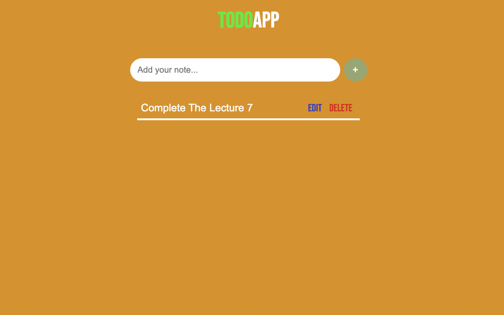

## Hi, I'm Sudhansu Sekhar Mahankuda ! 👋

### 🚀 I'm a front-end developer...

# TODO APP

- In this project you write your todo in the input box and click the plus button the todo will added to the we page with two edit and delete button , by clicking the delete button you can delete the Todo.

---

- It took me around  1 hour to make this project .

## 🛠 Skills
HTML, CSS, JavaScript

[LinkedIn](https://www.linkedin.com/in/sud-sekhar/)

[Netlify](https://todo-sud.netlify.app/)

